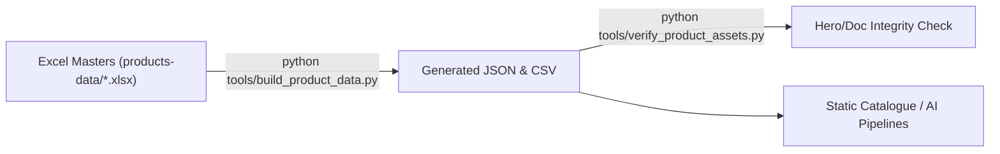

# Forestal MT Suite

Forestal MT Suite is the canonical brand, product, and operations repository for Forestal Murillo Tejada S. de R.L. de C.V.—covering every asset required to brief partners, automate catalogues, and feed AI/automation workflows. For the exhaustive description, metadata, and company background, see [`REPOSITORY_INFO.md`](REPOSITORY_INFO.md).

## Quick Start

1. **Install dependencies**
   - Python 3.10+ with `openpyxl` (install via `pip install -r requirements.txt` when available, or `pip install openpyxl`).
2. **Regenerate product data artifacts**
   ```bash
   python tools/build_product_data.py
   ```
   Produces `products-data/catalogue.json`, `sku-base.json`, `sku-presentations.json`, `retail.csv`, and `wholesale.csv` directly from the Excel masters.
3. **Verify referential integrity**
   ```bash
   python tools/verify_product_assets.py
   ```
   Confirms that every SKU in `data-manifest.json` has matching hero images, documentation links, and Excel sources.
4. **Refresh repository inventory**
   ```bash
   python tools/generate_inventory.py
   ```
   Updates the README snapshot, `REPOSITORY_INFO.md` structure block, and `INVENTORY.md`.
5. **Revisar resultados**
   ```
   git status
   ```
   Si los scripts generan o modifican archivos, verás los cambios listos para añadir antes del commit.

## Recommended Safeguards

1. **Enable bundled Git hooks** so automation runs before every commit:
   ```bash
   git config core.hooksPath .githooks
   chmod +x .githooks/pre-commit   # use `bash`/WSL if you're on Windows
   ```
   The hook executes the three scripts above and aborts the commit if they modify tracked files you haven’t staged.
2. **Rely on CI:** `.github/workflows/validate-repo.yml` reruns the same scripts on every push/PR and fails if the working tree isn’t clean afterward.

## Repository Map

| Path | Purpose |
| --- | --- |
| `assets/` | Logos (PNG + SVG), fonts (11 files), hero photography, and official letterhead templates. |
| `docs/` | Brand narrative, collection dossiers, company policies-each with YAML front matter for machine parsing. |
| `products-data/` | Excel masters, generated JSON/CSV exports, and the manifest that ties SKUs to assets. |
| `projects/` | Blueprints, manifests, and roadmaps for downstream builds (e.g., the digital catalogue). |
| `tools/` | Automation scripts (`build_product_data.py`, `verify_product_assets.py`) that keep data synchronized. |

## Repository Snapshot

<!-- AUTO-REPO-SNAPSHOT:START -->
_Last updated: 2025-11-11 05:42:08 UTC_

| Top-Level | Subdirs | Files | Size |
| --- | ---: | ---: | ---: |
| ./ (root) | 0 | 8 | 94.0 KB |
| .githooks/ | 0 | 1 | 385 B |
| .github/ | 1 | 2 | 2.5 KB |
| assets/ | 22 | 104 | 54.7 MB |
| docs/ | 3 | 16 | 48.5 KB |
| products-data/ | 0 | 9 | 485.1 KB |
| projects/ | 2 | 6 | 115.9 KB |
| tests/ | 0 | 2 | 3.5 KB |
| tools/ | 0 | 3 | 18.1 KB |
| **Total** | **28** | **151** | **55.5 MB** |

See [`INVENTORY.md`](INVENTORY.md) for the complete file listing.
<!-- AUTO-REPO-SNAPSHOT:END -->

## Key Documents

- Brand Identity: [`docs/brand/overview.md`](docs/brand/overview.md), [`docs/brand/voice.md`](docs/brand/voice.md), [`docs/brand/colors.md`](docs/brand/colors.md), [`docs/brand/typography.md`](docs/brand/typography.md), [`docs/brand/logo.md`](docs/brand/logo.md)
- Collections: [`docs/collections/batana-oil.md`](docs/collections/batana-oil.md), [`docs/collections/stingless-bee-honey.md`](docs/collections/stingless-bee-honey.md), [`docs/collections/traditional-herbs.md`](docs/collections/traditional-herbs.md)
- Company Operations: [`docs/company/company-profile.md`](docs/company/company-profile.md), [`docs/company/authenticity-chain.md`](docs/company/authenticity-chain.md), [`docs/company/shipping.md`](docs/company/shipping.md), [`docs/company/returns-policy.md`](docs/company/returns-policy.md), [`docs/company/business-hours.md`](docs/company/business-hours.md)
- Project Playbooks: [`projects/forestal-mt-digital-catalogue/`](projects/forestal-mt-digital-catalogue/) for manifests, IA, and build notes.

## Automation Workflow



- **Single Source of Truth:** All edits begin in the Excel workbook (`products-data/forestal-mt-products-catalogue-46-skus.xlsx`).
- **Deterministic Outputs:** The build script rewrites every machine-readable artifact, guaranteeing parity between CLI, IDE, and cloud environments.
- **Integrity Gate:** The verifier halts pipelines if any hero image, checksum, or doc reference drifts.

## Projects Directory

`projects/` is reserved for blueprints, manifests, and delivery plans. Example: `projects/forestal-mt-digital-catalogue/` lists every input file, the data flow, and UI/UX requirements for the HTML catalogue build. Use this area to document future initiatives (e.g., API integrations, AI agents) and link back to the assets/data they consume.
